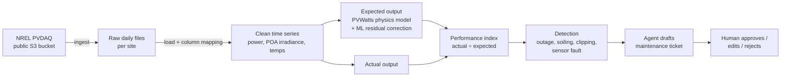

# Solar Performance Monitor

Compares each solar site's **actual** output with the output its **weather says it should have produced**, flags underperformance, and has an AI agent draft maintenance tickets for a human to approve.

Built on NREL's public [PVDAQ](https://data.openei.org/submissions/4568) dataset: real production and on-site weather sensor data from PV systems across the US.

> **Status: v0.2, first live version.** The full loop runs end to end: physics baseline, fault detection and classification, agent-drafted tickets, and a Streamlit approval queue. The hosted app currently runs on a labelled **demo dataset** for all five sites (physics-based weather for each site's location and mounting, with injected faults); real PVDAQ data swaps in with one command. See the [roadmap](#roadmap).

**What it does on the demo fleet:**

- Predicts 15-minute output within **2.8–3.1% nRMSE** on healthy days at every site (target was < 5%)
- Backtest over 300 simulated site-years (5 sites × 30 weather seeds × 2 years): **480 of 480** injected faults found, **478** labelled correctly, **1** false alarm. Abrupt faults are flagged the day they start; soiling about 3 weeks in, with the start of the slide traced back
- Recognises seven fault types, including tracker stalls on the single-axis site
- Drafts a maintenance ticket per event (template offline, Claude with an API key) and logs every approve / edit / reject with who did it

## Why this problem

An operator running dozens of sites can't eyeball every inverter curve. Production naturally swings with the weather, so "output dropped 20% today" means nothing on its own. A cloudy day and a tripped inverter look the same in raw kWh. The useful question is **"is this site producing what today's sunlight and temperature say it should?"** Answering that per site, per day, at fleet scale is what this project does.

## How it works


```mermaid
flowchart LR
    A[NREL PVDAQ<br/>public S3 bucket] -->|ingest| B[Raw daily files<br/>per site]
    B -->|load + column mapping| C[Clean time series<br/>power, POA irradiance, temps]
    C --> D[Expected output<br/>PVWatts physics model<br/>+ ML residual correction]
    C --> E[Actual output]
    D --> F[Performance index<br/>actual ÷ expected]
    E --> F
    F --> G[Detection<br/>outage, soiling, clipping,<br/>sensor fault]
    G --> H[Agent drafts<br/>maintenance ticket]
    H --> I[Human approves /<br/>edits / rejects]
```

1. **Ingest.** Download a site's files from NREL's public S3 bucket (no AWS account needed).
2. **Expected output.** NREL's PVWatts model (via [`pvlib`](https://pvlib-python.readthedocs.io/)) turns the site's own plane-of-array irradiance and module temperature into an expected AC power. A single scale factor, fit on a known-good reference window, calibrates it to that site's real-world losses. *(Phase 2 adds an ML model on the residuals to learn site-specific quirks the physics misses.)*
3. **Performance index (PI).** Daily actual energy ÷ expected energy. A healthy site sits near 1.0 regardless of weather.
4. **Detection.** Each day's PI is compared with a rolling baseline (75th percentile of recent PI, recomputed without flagged days so a long fault doesn't become the new normal). Runs of flagged days become events, classified by shape:

   | Event | Signature |
   |---|---|
   | Full outage | PI near zero |
   | Partial outage | Abrupt step down, then flat (an inverter, string or fuse) |
   | Soiling / gradual loss | Slow slide over weeks, often reset by rain or a wash |
   | Curtailment | Normal mornings and evenings, capped at midday on sunny days |
   | Tracker stall | The reverse: fine at midday, short in the morning and evening (rows parked flat) |
   | Irradiance sensor fault | Output *above* what the sensor allows, or no sensor data |
   | Monitoring data gap | No meter readings in daylight |

   Each event carries its evidence: PI before and during, energy lost and estimated cost, and the shape features behind the label.
5. **Ticket agent + approval UI.** Every event gets a draft ticket built from a fixed evidence packet (numbers, dates, shape features and an O&M playbook). With an `ANTHROPIC_API_KEY`, Claude writes the draft through a forced tool call, so the reply always fits the ticket schema and has only the packet's numbers to work from; any failure falls back to the template. Nothing is dispatched until a person approves it in the app, and every decision is logged with the reviewer and what they changed.

## Starter fleet

| ID | Site | Location | Size | Mount | Why it's here |
|---|---|---|---|---|---|
| 2107 | Farm Solar Array | Arbuckle, CA | 893 kW | Fixed, ground | Anchor site: 7 years, 125 sensor channels, passed NREL QA cleanly |
| 4902 | NIST Ground | Gaithersburg, MD | 271 kW | Fixed, ground | Heavily instrumented research array |
| 4903 | NIST Roof | Gaithersburg, MD | 74 kW | Fixed, roof | Same weather as 4902, different mounting |
| 1430 | NREL Mesa | Golden, CO | 721 kW | Single-axis tracker | Tracker physics, high altitude |
| 1367 | Henderson Aquatic Complex | Henderson, NV | 277 kW | Fixed | Hot desert climate |

Site metadata lives in [`config/sites.yaml`](config/sites.yaml).

## Quickstart

```bash
git clone https://github.com/mam084/solar-performance-monitor.git
cd solar-performance-monitor
python -m venv .venv && source .venv/bin/activate
pip install -e ".[dev]"

# 1. See what's available, then download a site (try --dry-run first to check the size)
python -m solarmon.ingest download 2107 --dry-run
python -m solarmon.ingest download 2107 --include meter irradiance environment
python -m solarmon.ingest download 4902 --start 2016-01-01 --end 2016-12-31

# 2. See which sensors the site has and get a suggested column mapping
python -m solarmon.inspect 2107
#    -> copy the right column names into config/sites.yaml

# 3. Explore and build the baseline
jupyter notebook notebooks/01_site_eda.ipynb

# 4. Check the raw data (mapping, file clocks, coverage, calibration), then run the pipeline
python -m solarmon.preflight 2107
python -m solarmon.pipeline build 2107            # add --claude to draft tickets with Claude
streamlit run streamlit_app.py

# No data yet? Build the demo site instead, and backtest the detector
python -m solarmon.pipeline build all --demo
python -m solarmon.backtest --seeds 30 --site all

# Tests run on synthetic data, so no download is needed
pytest
```

## Deploying the app

The app only reads `data/processed/`, which is small and committed, so it deploys as is.

1. On [share.streamlit.io](https://share.streamlit.io), create an app from this repo, branch `main`, file `streamlit_app.py`.
2. Optional: under *Settings → Secrets*, add `ANTHROPIC_API_KEY = "..."` to turn on **Redraft with Claude**.
3. To publish new results, rerun the pipeline locally and commit `data/processed/`; the app redeploys on push.

Approval decisions are saved to `data/processed/<id>/decisions.json`, which is git-ignored. On Streamlit Cloud that file lasts until the app restarts; a durable store is part of phase 4.

## Further reading

- [`docs/scaling.md`](docs/scaling.md): approach, results, and how this runs daily across a full fleet
- [`warehouse/`](warehouse/): Snowflake schema (raw → staging → marts) that `python -m solarmon.warehouse push` loads
- [`deploy/github-actions/daily-pipeline.yml`](deploy/github-actions/daily-pipeline.yml): scheduled daily run, ready to enable

## Repo layout

```
config/sites.yaml        fleet definition and per-site sensor column mapping
src/solarmon/
  ingest.py              download from NREL's public S3 bucket
  inspect.py             list a site's sensors and suggest a column mapping
  load.py                raw files -> one clean, time-indexed frame per site
  expected.py            PVWatts physics baseline + calibration
  metrics.py             daily performance index
  qa.py                  physical-limit cleaning and timestamp checks
  detect.py              baseline, daily flags, event detection and classification
  tickets.py             evidence packet, template drafter, Claude drafter
  review.py              approve / edit / reject log
  pipeline.py            raw -> expected -> PI -> events -> tickets -> data/processed/
  demo.py                synthetic site history with injected, labelled faults
  backtest.py            detector accuracy over many simulated histories
  preflight.py           checks a site's raw data and names the sites.yaml fix for each problem
  warehouse.py           shapes outputs into the Snowflake tables and loads them
warehouse/               Snowflake DDL: setup, raw + staging, marts
deploy/github-actions/   daily pipeline workflow (template)
docs/scaling.md          scaling and operations write-up
streamlit_app.py         fleet overview, site detail, ticket approval queue
data/processed/          pipeline outputs the app reads (committed, ~1.5 MB per site)
notebooks/               exploration, one notebook per question
tests/                   offline tests on synthetic data
```

## Roadmap

- [ ] **Phase 1: Baseline on one site**
  - [x] Repo, ingestion, and loader for both PVDAQ data layouts
  - [x] PVWatts expected-output model with calibration, plus a daily performance index
  - [x] Validated on the demo site: 2.9% nRMSE on healthy days
  - [ ] Run `preflight 2107`, then `pipeline build 2107` on the real data and confirm < 5% nRMSE (pin down the Jan 2024 irradiance offset first, see `config/sites.yaml`)
- [ ] **Phase 2: Fleet + detection**
  - [x] Underperformance detection and event classification, backtested on injected faults (480/480 found over 300 site-years)
  - [x] Demo histories for all 5 sites, including single-axis tracker physics
  - [ ] Backtest on real, logged events at site 2107
  - [ ] All 5 sites ingested and mapped
  - [ ] ML residual model (gradient boosting on weather and time features)
- [x] **Phase 3: Ticket agent + approval UI**
  - [x] Claude drafts tickets from flagged events with evidence (template fallback offline)
  - [x] Streamlit approval queue with edit, reject-with-reason, audit history and export
- [ ] **Phase 4: Productionize**
  - [x] Snowflake schema (raw → staging → marts) and loader, column-checked against the DDL in tests
  - [ ] Snowflake as the live store (run `warehouse/*.sql`, then `solarmon.warehouse push all`)
  - [x] Scheduled daily run written (`deploy/github-actions/daily-pipeline.yml`)
  - [ ] Enable it: copy to `.github/workflows/` and allow Actions to write
  - [ ] Durable store for approval decisions
  - [x] Write-up on scaling to a full fleet ([`docs/scaling.md`](docs/scaling.md))

## Data

Deline, C., Perry, K., Deceglie, M., Muller, M., Sekulic, W., & Jordan, D. (2021). *Photovoltaic Data Acquisition (PVDAQ) Public Datasets* [Data set]. Open Energy Data Initiative (OEDI), NREL. https://doi.org/10.25984/1846021. Licensed CC BY 4.0.
